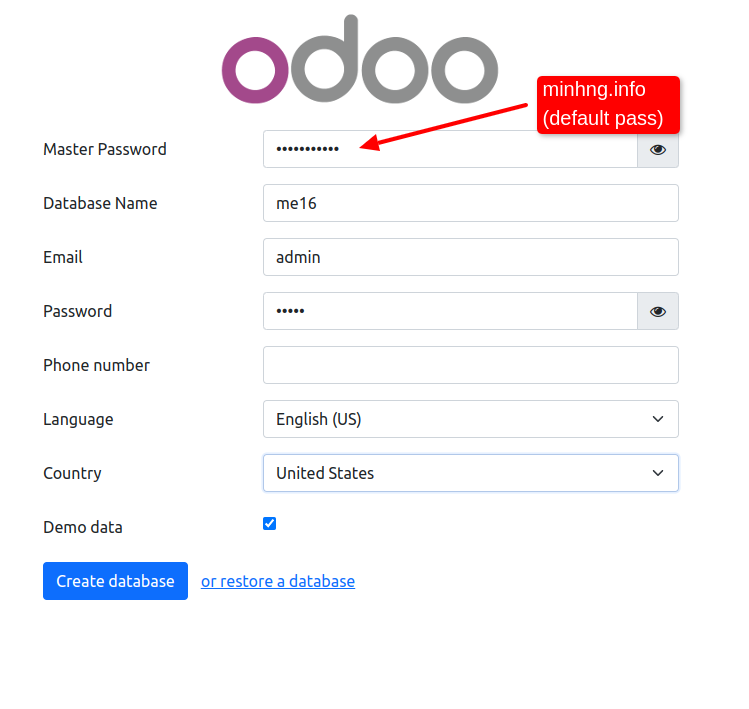
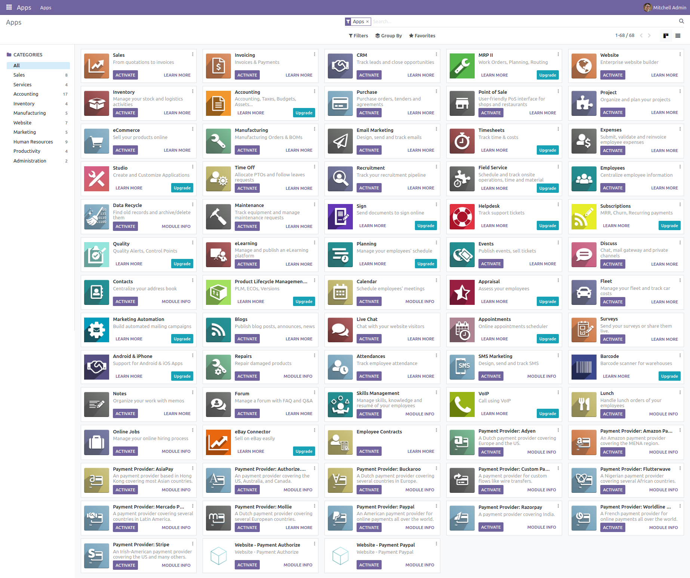

# Overview

This repository contains Docker configuration files and infrastructure as code (IAC) for deploying the OpenEMS backend on AWS. It is structured into several directories, each serving a specific purpose in the deployment process. Below is a brief description of each directory, its contents, and guidance on how to update configurations and obtain further information.

## `.github` Directory

### Workflows

The `.github/workflows` directory stores GitHub Actions workflows for deploying OpenEMS on AWS ECS. It includes a task definition file essential for ECS to update and restart the services automatically upon the successful execution of these workflows.

#### Considerations:

- **Availability Zones**: By default, the deployment targets the `US-EAST-1A` zone. You may adjust this setting to suit your preferred AWS Availability Zones.
- **AWS Account ID**: Modify the AWS Account ID in the `deploy-pipeline.yaml` and `openems-demo-td.json` files to match your AWS account credentials. Ensure to securely store your AWS access key ID and secret access key as GitHub secrets. The Docker image registry URL (e.g., `******.dkr.ecr.us-east-1.amazonaws.com/openems-ui:latest`) should include your AWS Account ID.

## `IAC` Directory

This directory contains Terraform scripts for provisioning the necessary AWS infrastructure for OpenEMS.

### Infrastructure Components:

- VPC with two public subnets
- Security groups
- ECS task role
- ECS Fargate service

#### Pre-requisites:

- **Backend Configuration**: Prior to deployment, create an S3 bucket and a DynamoDB table for state management and locking. Update the `backend.tf` file with your specific bucket name, key, region, and DynamoDB table name.
- **Secret Management**: The IAC utilizes AWS Secret Manager to inject credentials into the `ecs.tf` file securely.

## Service Folders: `Odoo`, `Odoo_database`, `Openems-backend`, `Openems-database`, `Openems-edge`, `Openems-ui`

Each folder contains Dockerfiles and related dependencies required to build the images for the respective microservices. Notably, the `Openems-backend` directory includes the `openems-backend.jar` file. For the latest version of this file, refer to the [OpenEMS GitHub releases page](https://github.com/OpenEMS/openems/releases/tag/2023.11.0).


## `Docker-compose yaml file` - Docker Compose Services

Below is a summary of the services defined in the Docker Compose file, outlining their roles within the project's architecture.

### `openems-ui`

- **Description**: Serves as the frontend interface for OpenEMS, offering a user-friendly web interface for system interaction.
- **Build Context**: `./openems-ui` directory.
- **Image**: `openems-ui:latest`

### `openems-backend`

- **Description**: Acts as the backend service for OpenEMS, handling core logic, data processing, and service integration.
- **Build Context**: `./openems-backend` directory.
- **Image**: `openems-backend:latest`

### `openems-database`

- **Description**: Provides the database services for OpenEMS, essential for backend data storage.
- **Build Context**: `./openems-database` directory.
- **Image**: `openems-db:latest`
- **Ports**: `5432:5432`, making the database accessible on the host machine.

### `odoo`

- **Description**: The Odoo ERP system, integrated with OpenEMS for comprehensive business management.
- **Build Context**: `./odoo` directory.
- **Image**: `odoo:latest`

### `odoo-database`

- **Description**: Hosts the database for Odoo, storing ERP system data.
- **Build Context**: `./odoo-database` directory.
- **Image**: `odoo-db:latest`
- **Ports**: `5433:5432`, accessible on the host machine.


## `Push-to-ecr.sh` file

The script is used in the Github action workflow to rename the docker compose images and push to amazon ecr.The script performs the following steps:

1. **Set AWS ECR URI**: Defines the URI for the AWS ECR where the Docker images will be pushed. This should be replaced with your AWS ECR URI.

2. **Identify Docker Compose File**: Assumes that the `docker-compose.yml` is located in the same directory as the script.

3. **Extract Image Names**: Parses the `docker-compose.yml` file to extract Docker image names. This step relies on the images being specified under the `image:` key within the Docker Compose file.

4. **Tag and Push Images**: Iterates over each extracted image, tags it with the AWS ECR URI, and pushes it to AWS ECR.

5. **Completion Message**: Outputs a confirmation message once all images have been successfully pushed to ECR.


# Installing Odoo 16.0 with one command (Supports multiple Odoo instances on one server).

## Quick Installation

Install [docker](https://docs.docker.com/get-docker/) and [docker-compose](https://docs.docker.com/compose/install/) yourself, then run the following to set up first Odoo instance @ `localhost:10016` (default master password: `minhng.info`):

``` bash
curl -s https://raw.githubusercontent.com/minhng92/odoo-16-docker-compose/master/run.sh | sudo bash -s odoo-one 10016 20016
```
and/or run the following to set up another Odoo instance @ `localhost:11016` (default master password: `minhng.info`):

``` bash
curl -s https://raw.githubusercontent.com/minhng92/odoo-16-docker-compose/master/run.sh | sudo bash -s odoo-two 11016 21016
```

Some arguments:
* First argument (**odoo-one**): Odoo deploy folder
* Second argument (**10016**): Odoo port
* Third argument (**20016**): live chat port

If `curl` is not found, install it:

``` bash
$ sudo apt-get install curl
# or
$ sudo yum install curl
```

## Usage

Start the container:
``` sh
docker-compose up
```
Then open `localhost:10016` to access Odoo 16.0.

- **If you get any permission issues**, change the folder permission to make sure that the container is able to access the directory:

``` sh
$ sudo chmod -R 777 addons
$ sudo chmod -R 777 etc
$ sudo chmod -R 777 postgresql
```

- If you want to start the server with a different port, change **10016** to another value in **docker-compose.yml** inside the parent dir:

```
ports:
 - "10016:8069"
```

- To run Odoo container in detached mode (be able to close terminal without stopping Odoo):

```
docker-compose up -d
```

- To Use a restart policy, i.e. configure the restart policy for a container, change the value related to **restart** key in **docker-compose.yml** file to one of the following:
   - `no` =	Do not automatically restart the container. (the default)
   - `on-failure[:max-retries]` =	Restart the container if it exits due to an error, which manifests as a non-zero exit code. Optionally, limit the number of times the Docker daemon attempts to restart the container using the :max-retries option.
  - `always` =	Always restart the container if it stops. If it is manually stopped, it is restarted only when Docker daemon restarts or the container itself is manually restarted. (See the second bullet listed in restart policy details)
  - `unless-stopped`	= Similar to always, except that when the container is stopped (manually or otherwise), it is not restarted even after Docker daemon restarts.
```
 restart: always             # run as a service
```

- To increase maximum number of files watching from 8192 (default) to **524288**. In order to avoid error when we run multiple Odoo instances. This is an *optional step*. These commands are for Ubuntu user:

```
$ if grep -qF "fs.inotify.max_user_watches" /etc/sysctl.conf; then echo $(grep -F "fs.inotify.max_user_watches" /etc/sysctl.conf); else echo "fs.inotify.max_user_watches = 524288" | sudo tee -a /etc/sysctl.conf; fi
$ sudo sysctl -p    # apply new config immediately
``` 

## Custom addons

The **addons/** folder contains custom addons. Just put your custom addons if you have any.

## Odoo configuration & log

* To change Odoo configuration, edit file: **etc/odoo.conf**.
* Log file: **etc/odoo-server.log**
* Default database password (**admin_passwd**) is `minhng.info`, please change it @ [etc/odoo.conf#L60](/etc/odoo.conf#L60)

## Odoo container management

**Run Odoo**:

``` bash
docker-compose up -d
```

**Restart Odoo**:

``` bash
docker-compose restart
```

**Stop Odoo**:

``` bash
docker-compose down
```

## Live chat

In [docker-compose.yml#L21](docker-compose.yml#L21), we exposed port **20016** for live-chat on host.

Configuring **nginx** to activate live chat feature (in production):

``` conf
#...
server {
    #...
    location /longpolling/ {
        proxy_pass http://0.0.0.0:20016/longpolling/;
    }
    #...
}
#...
```

## docker-compose.yml

* odoo:16.0
* postgres:15

## Odoo 16.0 screenshots after successful installation.






