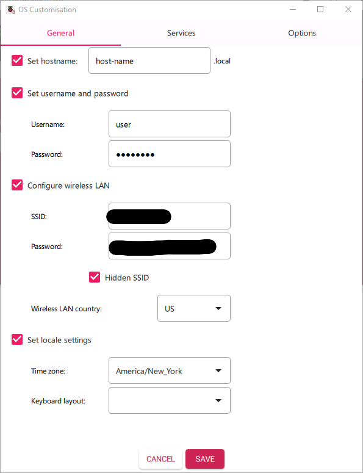
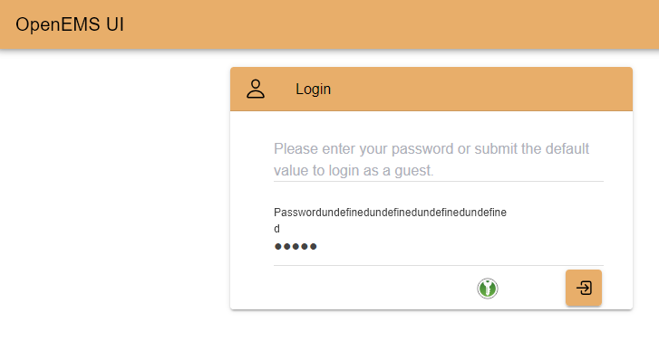

111925 - OpenEMS Pi Edge x local UI over LAN 
========================================

This guide will walk through connecting an OpenEMS UI container *([hosted by] Client)* 
with an OpenEMS Edge simulated device *(Edge)* using  OpenEMS  v2025.11.0

### Requirements:
Pi-Based Edge Device 

(in my case) SL-RP4 with embedded Raspberry Pi 4B

2GB RAM

16GB Micro SD card + Micro SD reader/adapter


### Software Requirements/Dependencies:
SSH

Rsync or WinSCP(Windows)

Raspberry Pi Imager

Docker Desktop

OpenEMS Source Code - (release 2025.11.0)

Adoptium Open JDK Temurin 21


## Fresh Device deployment
### Format SD Card
*Client*

Install and launch Raspberry Pi Imager

**Raspberry Pi Device** - Raspberry Pi 4

**Operating System** - Raspberry Pi OS / Lite (64-bit) 
*(Debian Trixie, Release 2025-10-01)*

**Storage** - Connect your SD card and select it from the storage options.

Select **Next** and **Edit Settings** for OS customization
GENERAL:
*NOTE: Wireless LAN is optional if not connecting to Pi via Ethernet cable*


SERVICES:
Ensure **Enable SSH** is checked, configure authentication accordingly
Formatting the SD card

### While Formatting...
*Client*

Download OpenEMS source code

`git clone -b 2025.11.0 https://github.com/OpenEMS/openems piDeployDemo`

Navigate to project root directory
`cd path/to/piDeployDemo`
Build Docker UI-edge-only image 
`docker build . -t openems_ui -f tools/docker/ui/Dockerfile.edge`

### Setting up the Pi
Transfer the formatted SD card to the Pi, connect to networking, and power on.
When green status LED is solid, open a terminal and SSH into your *Edge*
*Edge*
```
ssh user@host-name.local
mkdir downloads
cd downloads

```

### Installing Java
*Edge*

Download requirements

```
## download OpenEMS precompiled jar file
wget https://github.com/OpenEMS/openems/releases/download/2025.11.0/openems-edge.jar

## make executable
sudo chmod +x openems-edge.jar
```
Install the Java JDK
```
##install prerequesites
sudo -s
-apt install -y wget apt-transport-https gpg
wget -qO -https://packages.adoptium.net/artifactory/api/gpg/key/public | gpg --dearmor | tee /etc/apt/trusted.gpg.d/adoptium.gpg > /dev/null
echo "deb https://packages.adoptium.net/artifactory/deb $(awk -F= '/^VERSION_CODENAME/{print$2}' /etc/os-release) main" | tee /etc/apt/sources.list.d/adoptium.list
exit
sudo apt update
  
##install java
sudo apt install temurin-21-jdk
```

### Set up OpenEMS as a service
*Edge*

```
sudo mkdir /usr/lib/openems
sudo mv openems-edge.jar /usr/lib/openems
sudo mkdir /etc/openems.d
```
Create a service file
```
sudo nano /etc/systemd/system/openems.service
```
And paste the following contents:
```
[Unit] 
Description=OpenEMS Edge 
After=network.target

[Service] 
User=root 
Group=root 
Type=notify 
WorkingDirectory=/usr/lib/openems 
ExecStart=/usr/bin/java -Dfelix.cm.dir=/etc/openems.d/ -jar /usr/lib/openems/openems-edge.jar
 
SuccessExitStatus=143 
Restart=always 
RestartSec=10 
WatchdogSec=60

[Install] 
WantedBy=multi-user.target
```
Use CTRL+X , then Y to save and exit the file
`sudo systemctl daemon-reload`

## Execute
*Edge*

`systemctl restart openems --no-block; journalctl -lfu openems`
Follow OpenEMS 'getting started' documentation to configure Edge (Sec 5, steps 1-8)
*NOTE: UI will not communicate with edge until the websocket 
(8085 as per Getting Started guide) is configured*
https://openems.github.io/openems.io/openems/latest/gettingstarted.html#starting-a-simulation

*Client* 

Acces host at localhost/login and the UI page should appear, login with `admin` as password

Change language via top-left menu > click admin user icon > "Sprache Wahlen" dropdown 
Refresh UI page or use top left 'back' button to return ot overveiw 

### Create+Launch Docker container for UI 
*Client*

 *NOTE: Ensure WEBSOCKET_HOST points to your Pi's hostname or static IP*

`docker container run -e WEBSOCKET_HOST=host-name.local -p 443:443 -p 80:80 --name openems_ui_container openems_ui` 
